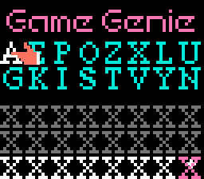
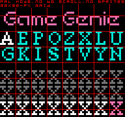
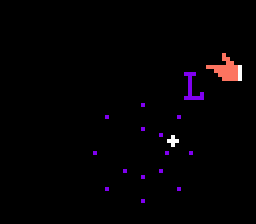

# nes-gg-disassembly
A disassembly of the ROM of the [NES](https://en.wikipedia.org/wiki/Nintendo_Entertainment_System) cheat cartridge [*Game Genie*](https://en.wikipedia.org/wiki/Game_Genie). Assembles with [ASM6](https://www.romhacking.net/utilities/674/).

## How to assemble
* Download the original Game Genie ROM from e.g. [NESDev](https://archive.nesdev.org).
* Copy the CHR ROM data (the last 256 bytes) to a new file, `chr.bin`. (Use e.g. a hex editor.)
* Assemble:
  * `asm6 prg.asm prg.bin`
  * `asm6 genie.asm genie.nes`
* `prg.bin` is no longer needed.
* Make sure `genie.nes` is identical to the original Game Genie ROM file.

Note: the Linux script `assemble.sh` is for my personal use only. Do not run it before reading it.

## Screenshots

### Normal screenshot
* NTSC mode (256×224 pixels)



### Attribute Table byte boundaries
* PAL mode (256×240 pixels)
* background scrolling disabled (by hacking the ROM)
* sprites hidden (using emulator settings)
* a red 32×32-pixel grid and text added (photoshopped)



### Sprites
* NTSC mode (256×224 pixels)
* background hidden (using emulator settings)
* the hand cursor, the revolving cursor, a flying letter (`L`) and flying particles can be seen



## Parts of the Game Genie screen
* *flying letter*: a letter that flies from the virtual keyboard to the input area when a letter is entered
* *hand cursor*: looks like a hand, moved with arrow keys, on the input area or on the virtual keyboard
* *input area*: where the entered codes appear; initially filled with dashes (`-`)
* *particles*: small squares that fly when a letter is deleted
* *revolving cursor*: revolves around a letter or dash (`-`) on the input area; looks like a plus sign (`+`)
* *virtual keyboard*: the letters `AEPOZXLU GKISTVYN`

## Bugs
* Sometimes, the letter or dash (`-`) under the revolving cursor on the input area does not flash.
  * How to reproduce:
    * boot up the ROM
    * observe the first dash (it does not flash)
    * press B
    * observe the first dash (it flashes)
* You can sometimes delete non-final letters of the code.
  * How to reproduce:
    * enter `AAAAAAAA` on the last line (you need to move the cursor manually from the 6th to the 7th letter)
    * press B three times
    * observe the code (`AAAAA-AA`)
* The bottom half of the flying letter sometimes looks corrupt and flashing.
  * How to reproduce (use pause&frame advance on an emulator for best results):
    * enter any two letters (e.g. `UU`)
    * immediately delete the last letter (press B)
    * immediately delete another letter (press B)
    * observe the bottom half of the flying letter (it is corrupt and flashes)
* A variation of the previous bug: sometimes, the bottom half of the flying letter flashes and some flying particles disappear.
  * How to reproduce (use pause&frame advance on an emulator for best results):
    * enter two letters or more (e.g. `UUU`)
    * delete the last letter (press B)
    * immediately delete another letter (press B)
    * immediately enter another letter (e.g. `U`)
    * observe the bottom half of the flying letter (it flashes) and note the missing particles

The sprite-related bugs seem to be caused by some sprites being assigned to both the flying letter and the flying particles.

## FCEUX Code/Data log
I created a code/data log file (`.cdl`) of the ROM using the Code/Data Logger in FCEUX.
The file is in `gamegenie.cdl.gz` (gz compressed).

I also converted the CDL file into a human-readable format using my [cdl-summary](https://github.com/qalle2/cdl-summary) with the arguments `--prg-size 16` and `--bank-size 16`.
The unedited result is in `cdl-summary-raw.csv`.

Below is the manually-edited data.
The columns are: CPU address range (hexadecimal), length (decimal), description.

```
f000-f028 ( 41): code
f029-f029 (  1): code, data
f02a-f10d (228): code
f10e-f10e (  1): code, data
f10f-f179 (107): code
f17a-f17a (  1): code, data
f17b-f1b8 ( 62): code
f1b9-f1b9 (  1): code, data
f1ba-f245 (140): code
f246-f247 (  2): unaccessed
f248-f25a ( 19): code
f25b-f25b (  1): code, data
f25c-f2a7 ( 76): code
f2a8-f2a8 (  1): code, data
f2a9-f2b8 ( 16): code
f2b9-f2b9 (  1): code, data
f2ba-f330 (119): code
f331-f331 (  1): code, data
f332-f374 ( 67): code
f375-f375 (  1): unaccessed
f376-f3b4 ( 63): code
f3b5-f3b5 (  1): code, data
f3b6-f3fa ( 69): code
f3fb-f41e ( 36): data
f41f-f41f (  1): code, data
f420-f4bf (160): code
f4c0-f4c0 (  1): code, data
f4c1-f52c (108): code
f52d-f52d (  1): code, data
f52e-f55c ( 47): code
f55d-f55d (  1): code, data
f55e-f564 (  7): code
f565-f565 (  1): code, data
f566-f5ae ( 73): code
f5af-f5af (  1): code, data
f5b0-f69f (240): code
f6a0-f6a0 (  1): code, data
f6a1-f6d5 ( 53): code
f6d6-f6d6 (  1): code, data
f6d7-f6fa ( 36): code
f6fb-f6fb (  1): code, data
f6fc-f6fe (  3): code
f6ff-f77e (128): data (indirectly accessed)
f77f-f7e3 (101): code
f7e4-f7e4 (  1): code, data
f7e5-f7eb (  7): code
f7ec-f7ec (  1): code, data
f7ed-f842 ( 86): code
f843-f856 ( 20): data
f857-f857 (  1): code, data
f858-f864 ( 13): code
f865-f865 (  1): code, data
f866-f87a ( 21): code
f87b-f87b (  1): code, data
f87c-f8a4 ( 41): code
f8a5-f8a5 (  1): code, data
f8a6-f8d6 ( 49): code
f8d7-f8d7 (  1): code, data
f8d8-f908 ( 49): code
f909-f909 (  1): code, data
f90a-f95a ( 81): code
f95b-f95b (  1): code, data
f95c-f971 ( 22): code
f972-f972 (  1): code, data
f973-f977 (  5): code
f978-f978 (  1): code, data
f979-fa0c (148): code
fa0d-fa1c ( 16): data
fa1d-fa1d (  1): unaccessed
fa1e-fa2d ( 16): data
fa2e-fa2e (  1): unaccessed
fa2f-fa64 ( 54): code
fa65-fa65 (  1): code, data
fa66-fa87 ( 34): code
fa88-faa7 ( 32): data
faa8-fb09 ( 98): code
fb0a-fb0a (  1): code, data
fb0b-fb55 ( 75): code
fb56-fb56 (  1): code, data
fb57-fb92 ( 60): code
fb93-fb93 (  1): code, data
fb94-fba3 ( 16): code
fba4-fba4 (  1): code, data
fba5-fbd8 ( 52): code
fbd9-fbd9 (  1): code, data
fbda-fd02 (297): code
fd03-fd0a (  8): data
fd0b-fd0b (  1): code, data
fd0c-fd2c ( 33): code
fd2d-fd3c ( 16): data
fd3d-fdc8 (140): code
fdc9-fdc9 (  1): code, data
fdca-fdff ( 54): code
fe00-fe00 (  1): code, data
fe01-fe46 ( 70): code
fe47-fe4a (  4): unaccessed
fe4b-fe6f ( 37): code
fe70-fe70 (  1): code, data
fe71-fe7d ( 13): code
fe7e-fe7f (  2): unaccessed
fe80-fe88 (  9): code
fe89-fe8a (  2): unaccessed
fe8b-fe9e ( 20): code
fe9f-febd ( 31): data
febe-febf (  2): unaccessed
fec0-fee7 ( 40): data (indirectly accessed)
fee8-feed (  6): unaccessed
feee-ffe5 (248): data (indirectly accessed)
ffe6-ffef ( 10): unaccessed
fff0-fff1 (  2): data
fff2-fff9 (  8): unaccessed
fffa-fffd (  4): data
fffe-ffff (  2): unaccessed
```

## Speculation
The Game Genie may have been originally designed to support four codes instead of three:
* At `$fdb0`, `decoded_codes` (`$0090`) is initialized to length 16 instead of 12.
* At `$fe43`, the address of the code that was just decoded is compared to the first three codes, not just two.
* There is space for 32 letters in `entered_letters` (`$066b`).
* Even on an NTSC TV, there would be just enough space vertically for four codes (4 tiles for logo, 8 tiles for virtual keyboard, 16 tiles for the codes).

However:
* There are not enough bits for four codes in `genie_master_control` (`$8000`).
* There are no unused registers immediately after `genie_master_control`.
* A genie usually grants three wishes, not four.

## References
* [NESDev Wiki](https://wiki.nesdev.org) (e.g. [the Game Genie article](https://wiki.nesdev.org/w/index.php/Game_Genie))
* [NES Game Genie Code Format DOC](https://archive.nesdev.org/nesgg.txt)

However, I have *not* used earlier Game Genie disassemblies such as [game-genie-disassembly by Kevin Selwyn](https://github.com/kevinselwyn/game-genie-disassembly) (I discovered it just before publishing my disassembly).

## Programs used
* [FCEUX](https://fceux.com) (Debugger, Code/Data Logger, etc.)
* [`nes-sprites.lua`](https://forums.nesdev.org/viewtopic.php?f=2&t=13255) for FCEUX by tokumaru
* a quick&amp;dirty disassembler I wrote myself
